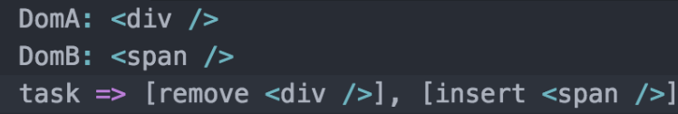
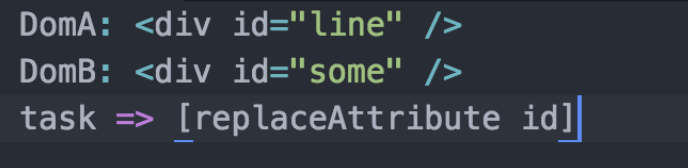
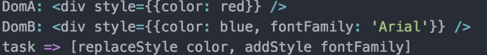

#  Main Principle 

## План
 * VDOM
 * Reconciliation rules and keys
 * LifeCycle
 * Наследование против Композиции
 * SetState несколько форм работы
 * HOC, function is a child component, context, refs

 ### VDOM
 Виртуальный DOM (VDOM) — это концепция программирования, в которой идеальное или «виртуальное» представление пользовательского интерфейса хранится в памяти и синхронизируется с «настоящим» DOM при помощи библиотеки, такой как ReactDOM. Этот процесс называется согласованием.
 
 
 
### Reconciliation rules and keys
   1. Два компонента схожего класса будут генерировать одинаковые деревья
   2. Два компонента различного класса будут генерировать различные деревья
   3. Возможность генерации уникального ключа для элементов, который стабильный при разных рендерах

   Примеры:

```
   1. Вы можете обратить внимание на то, как происходит сравнение двух React Element (узла).  React относиться к ним как к разным (аналогичная логика и для пользовательских компонентов)
```

```  
   2. В линейном времени смотрится и на атрибуты, и оценивается что из них изменилось.
```

```
  3. С inline-style тоже все просто, вместо просмотра их в виде строк, можно смотреть, как на объект с ключем-значением. Позволит обновить только то, что действительно изменилось.
```



 ### LifeCycle

 
